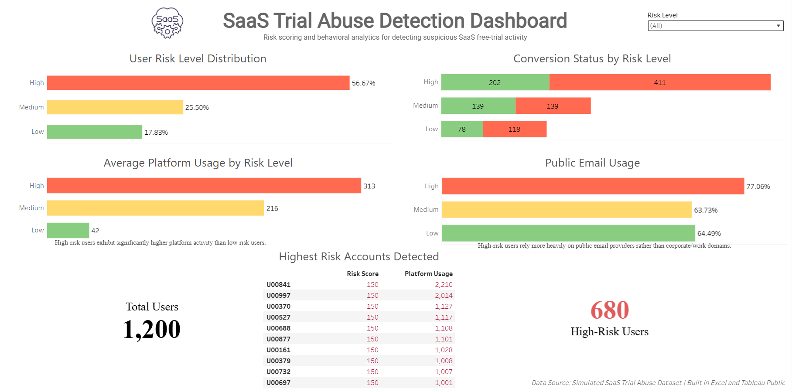

# SaaS Trial Abuse Detection

## Overview

This case study analyzes potential abuse of SaaS free-trial accounts through behavioral risk scoring and exploratory analytics.

## Tools Used

- Microsoft Excel
- Power Query
- Tableau Public

## Dashboard Preview

## Documentation

The repository includes:

- Data Quality Notes
- Data Dictionary
- Data Cleaning Log
- Analysis Workflow

## Tableau Dashboard

View the interactive dashboard:

[Dashboard Preview](https://public.tableau.com/app/profile/gregory.jude.manga/viz/SaaSTrialAbuseDetection/Dashboard1#1)

## Important Note

This project was completed using a simulated assessment dataset.

Original source datasets are intentionally excluded from this repository.

Only documentation, methodology, dashboard outputs, and supporting materials are shared.
